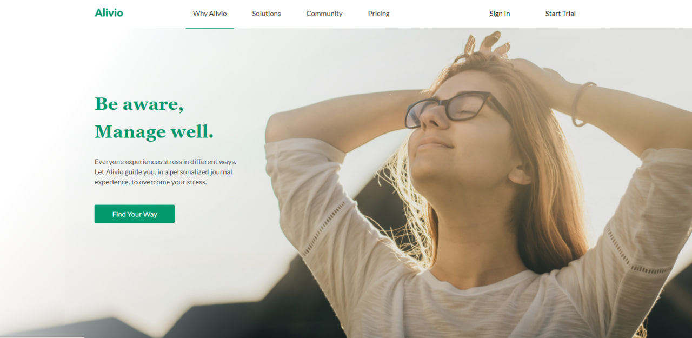
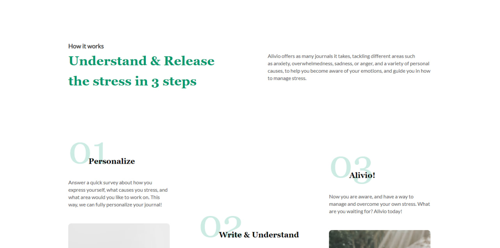
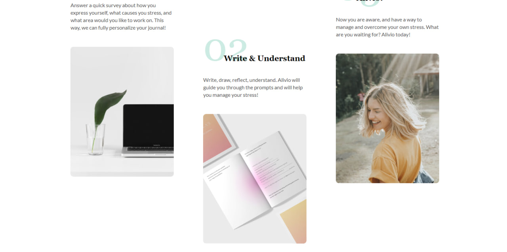
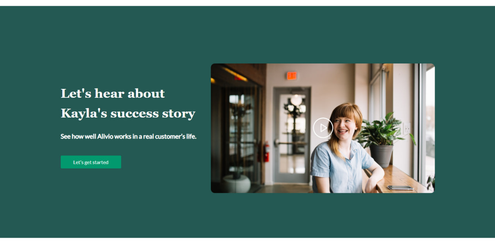
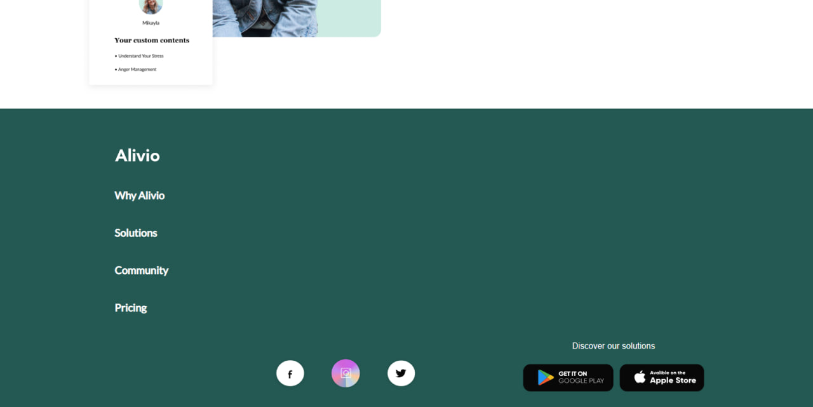

# JS-Camp  
  

Homework-1 Summary - Figma Landing Page

 
 This repository contains the homework assignment for creating a landing page based on a Figma design. The implementation of this project relied solely on HTML and CSS. No frameworks or libraries were used to keep the focus on understanding and applying core web development concepts.
  

[DEMO](https://martthaa.github.io/JS-Camp/)

